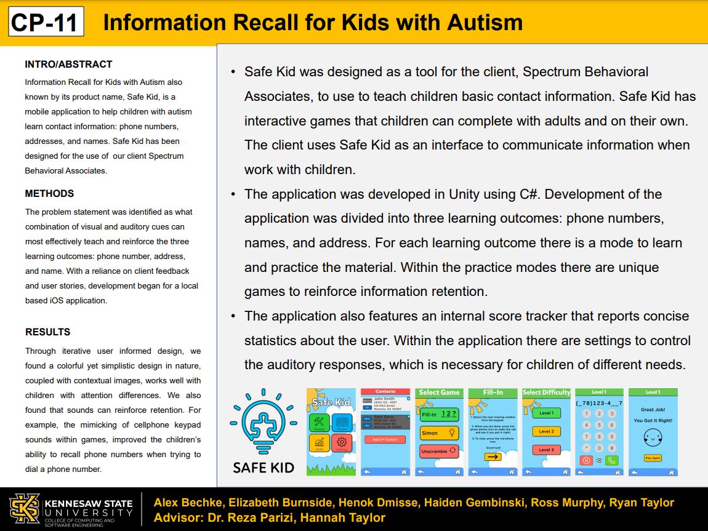

# Safe Kid
My senior capstone project from Spring 2021. Safe Kid is a mobile application to assist children with developmental disabilities learn and practice essential contact information through the use of unique games and practice modes. Developed in partnership with Spectrum Behavioral Associates, LLC.

